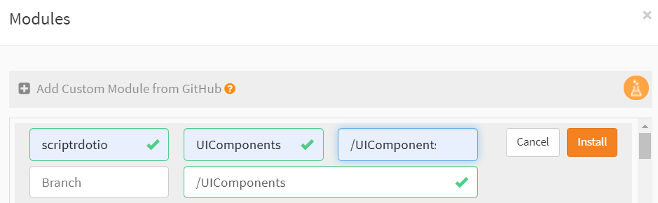
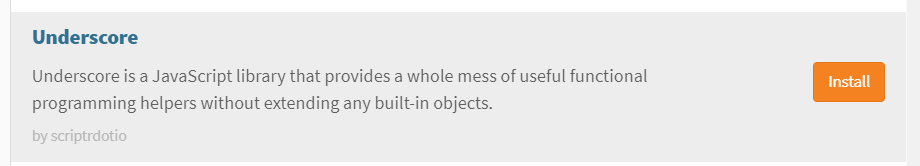

# convergia_lorawan_app_demo

- [Install the application](#install-the-application)
- [Install dependencies](#install-dependencies)
- [Configure the application](#configure-the-application)
- [How to](#how-to)

## Install the application
- From the scriptr.io web IDE, click the arrow on the right of "New Script" on the bottom left corner of the screen then select "Install Module"
- In the Modules wizard, click "+Add custom module from Github"
- Fill the fields as follows (see image below)
  - Owner: **convergia**
  - Repository: **lorawan-app**
  - Path: /app
  - Branch: leave empty or type **master**
  - Destination folder: /
- Run the script in the path **/app/install/auto.install.scriptr** to setup the environment 

## Install dependencies
- UIComponents module
- Underscore
- Hogan

### Install UIComponents
- From the scriptr.io web IDE, click the arrow on the right of "New Script" on the bottom left corner of the screen then select "Install Module"
- In the Modules wizard, click "+Add custom module from Github"
- Fill the fields as follows (see image below)
  - Owner: **scriptrdotio**
  - Repository: **UIComponents**
  - Path: /UIComponents
  - Branch: leave empty or type **master**
  - Destination folder: /UIComponents
 
 

### Install Underscore
- From the scriptr.io web IDE, click the arrow on the right of "New Script" on the bottom left corner of the screen then select "Install Module"
- In the Modules wizard, scroll down to **Underscore** (see image below)
- Click the "Install" button.

### Install Hogan
- From the scriptr.io web IDE, click the arrow on the right of "New Script" on the bottom left corner of the screen then select "Install Module"
- In the Modules wizard, scroll down to **Hogan** 
- Click the "Install" button.

## Configure the application
In the tree view on the left side of the scriptr.io web IDE

### Configure the App

- Scroll to **/app/config/config** and open the config script
- Replace the **subdomain** with your account subdomain

### Configure the simulator

- Scroll to **/lorawan-app/simulator/meshilum/config** and open the config script
- Replace the **subdomain** with your account subdomain

- Replace the **token** value of the  **var dmpBrokerToken** variable with your own dmpBrokerToken
  

## How to

### How to obtain my dmpBrokerToken 
When you registered to scriptr, an account was created for you on the platform and an authentication token was allocated to it. 
To get your account token:
- open the workspace then click on your username on the top right corner of the screen.
- In the drop-down list, click on Device Directory
- Copy the value of the token field next to myDmpBroker.

